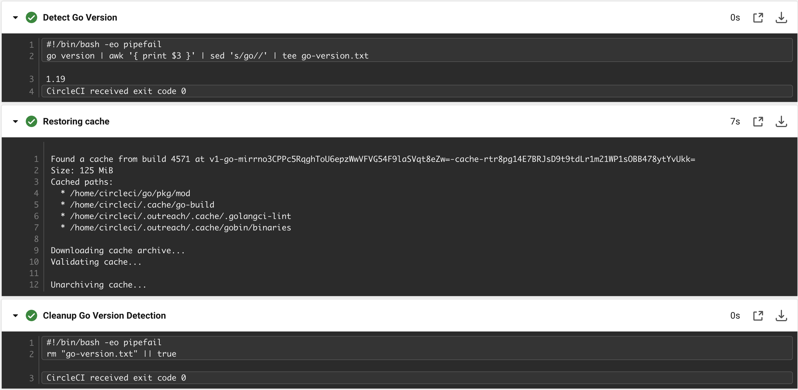

# RFC-337: Daily CI Cache Rebuilds

## Table of Contents

<!-- toc -->
- [Summary](#summary)
- [Motivation](#motivation)
  - [Goals](#goals)
- [Design Details](#design-details)
- [Testing and Release Plan](#testing-and-release-plan)
- [Implementation History](#implementation-history)
- [Drawbacks](#drawbacks)
- [Alternatives](#alternatives)
<!-- /toc -->

## Summary

This RFC proposes a new caching strategy for CI builds that will speed up the
builds and reduce the cost of running CI. This new strategy will generate the
caches daily, as opposed to on each run. This keeps caches small, reducing the
time to consume and generate them on each run.

## Motivation

CircleCI builds currently take a long time to run. This is due to the fact that
we are currently creating caches with the entirety of the asdf directory (to
avoid having to re-download languages on every run) as well as language specific
cache (e.g. golangci-lint cache). Importing these requires `checksum`, a CircleCI
function to calculate the checksum of a file, to be used to ensure the correct
version of each language is being used, which leads to a lot of extra steps in the
cache generation process.

### Example: Golang Version Calculation

Currently there are 3 steps to calculating the golang version, as we can see below:

This is a lot of extra steps that ends up making the cache generation process
take up a lot of space in the CI pipeline, making it harder for users to understand
what's going on and separate it from the business logic of the pipeline.

### Goals

- Reduce the time it takes to generate caches
- Reduce the time it takes to consume caches
- Reduce the amount of dependencies fetched outside of the cache (i.e. asdf
  languages)
- Reduce the size of the caches, as much as possible (without sacrificing
  the above goals)

## Design Details

The proposed solution is to generate the caches daily and consume them in each CI job.

This will be done by creating a new `generate-cache` workflow that runs a job creating
the cache required for each job (asdf, go cache, etc.) then uploading them to CircleCi
using the `save_cache` command in the format of `v1-daily-cache-{{ timestamp }}`.

These caches will be imported by using the `restore_cache` command, which will restore
the newest cache that matches the key `v1-daily-cache` as per
[CircleCI `restore_cache` docs](https://circleci.com/docs/caching#restoring-cache).

The daily cache will only run if the current commit is different from the last commit
that generated the cache. This will be done by storing the commit hash in a file in
the cache and comparing it to the current commit hash.

### What is in a Cache?

A cache today currently contains the following:

- **Machine Mode Only** `~/.asdf` - The asdf version manager language installs and go cache
- `~/go/pkg` - The Go package cache (broken, this is per asdf version (see `go env GOROOT`))
- `~/.outreach/.cache/.golangci-lint` - golangci-lint cache
- `~/.cache/go-build` - The Go build cache (broken, we don't output build cache there (see `go env GOCACHE`))

The planned cache will instead be:

- **Now Always** `~/.asdf` - The asdf version manager language installs, etc
- `~/.outreach/.cache` - All caches for Outreach tooling
- `~/.cache` - All caches for other tooling (including `go-build` and `golangci-lint`)

This will catch essentially all caches that are currently being generated, and
will be easier to manage as we can just add new caches to the standard `~/.cache`
directory as needed. The reasoning behind caching `asdf` is that it allows us to keep
slim docker images that don't need to contain any languages out of the box.

## Testing and Release Plan

Run on CI for a week on two internal Outreach services to ensure that the
caching strategy is working as expected. We could potentially create a job
that runs a cache workflow, using [setup workflows](https://circleci.com/docs/dynamic-config)
to run the cache workflow on a PR and ensures that it caches the paths
expected.

## Implementation History

- 2022-10-03: Initial draft

## Drawbacks

Generating caches daily creates the possibility of a cache being out of date
for a period of time. This is mitigated by the fact that `devbase`, and other tools,
will fetch things not inside of the cache. This causes a temporary slowdown, but is
only a problem for a day. This is further mitigated by being able to re-trigger the
cache generation process anytime.

## Alternatives

- Keep the current cache generation process, and just fix the cache generation to
  properly include all directories required for caching (e.g. go cache). This would
  help make the cache more efficient, but it would not solve the problem of the asdf
  version cache being bloated over time without introduction of more dynamic cache
  key computation and would continue to bloat CI logs.
